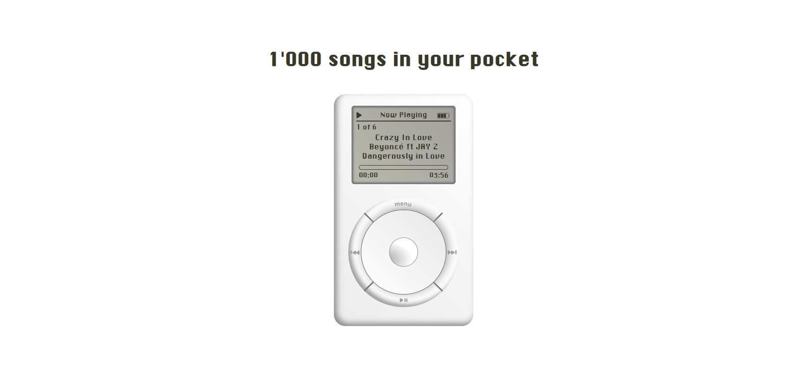

# [iPod - Custom audio / video player](https://kilelx.github.io/ipod/)

## Contest rules

-   **Brief :** Create a page with a custom audio / video player
-   **Start :** 03/20/2023 (10:00 am)
-   **End :** 04/02/2023 (11:59 pm)

Contest from <a href="https://discord.gg/ThmPjSfc" target="_blank">Le Repaire du Web</a>

## Description

🎵 iPod : 1'000 songs in your pocket

-   🍏 The first iPod, 100% designed in CSS _excepted some icons_
-   One of the most famous slogan : **1'000 songs in your pocket**
-   The basic features are available : `Play` / `Pause`, `Go to the next song` / `Go to the previous song`, `Go automatically to the next song when the current one ends`
-  I tried to be as much faithful as I can to the original. I also had fun with gradient animations.
-  I manually put 6 old songs in a `data.js`, in memory of the good old days (sorry for the copyright 🥷)

## Things I'd like to improve

-   I could't find out how I could handle with the sound when scrolling on mobile

# Preview

